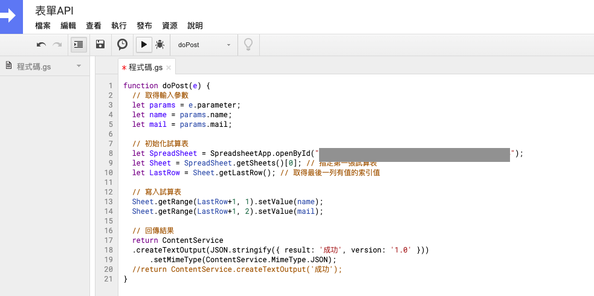

此篇教學實作透過前端網頁，將資料寫入雲端硬碟中的 Google Sheets 當中。透過此方法我們就不需要建立後端資料庫來儲存這些表單資料。

## 建立 Google 雲端試算表
首先開啟[雲端硬碟](https://drive.google.com/)建立一個空白的試算表。在空白處點選右鍵即可新增一個Excel試算表。


這邊範例為GAS表單測試。可以在第一行寫入你要收集資料的欄位名稱，這裏的範例是要搜集使用者的`姓名`和`信箱`。


## 建立 Google App Script
首先可以先進入到 [Google Apps Script](https://script.google.com/home/start) 服務(以下簡稱 GAS)。服務介面類似於 Google 雲端硬碟。在這邊就可以撰寫你的 GAS 函式並部署執行。簡單來說 GAS 是一種serverless服務，即 Google 會在服務背後提供伺服器運行。使用者只要撰程式碼並部署，即可在一個獨立的伺服器上運行你的程式。


點選新的空白專案就會開啟 GAS 的編輯界面。就可以來撰寫API囉，首先函數名稱設為 `doPost` 代表 API method 爲 Post。接著我們要使用 SpreadsheetApp 類別初始化試算表，在圖片灰色框框輸入你的試算表 id。id 就是 Google Sheet 網址列 https://docs.google.com/spreadsheets/d/ 以後至 edit 中間的代碼。



```js
function doPost(e) {
  // 取得輸入參數
  let params = e.parameter; 
  let name = params.name;
  let mail = params.mail;
 
  // 初始化試算表
  let SpreadSheet = SpreadsheetApp.openById("輸入你的試算表 id");
  let Sheet = SpreadSheet.getSheets()[0]; // 指定第一張試算表
  let LastRow = Sheet.getLastRow(); // 取得最後一列有值的索引值

  // 寫入試算表
  Sheet.getRange(LastRow+1, 1).setValue(name);
  Sheet.getRange(LastRow+1, 2).setValue(mail);
  
  // 回傳結果
  return ContentService
  .createTextOutput(JSON.stringify({ result: '成功', version: '1.0' }))
      .setMimeType(ContentService.MimeType.JSON); 
}
```